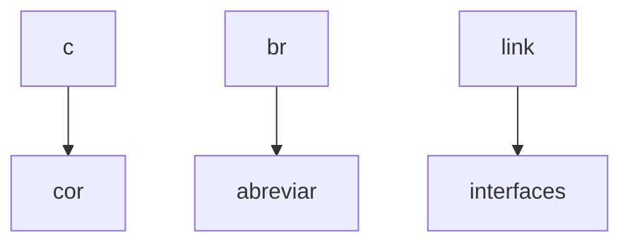
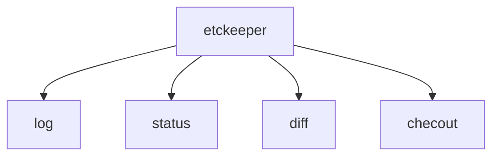

# Anotaçẽos 02/05/22 e 09/05/22
### IP, interface de rede, par de chaves, vscode extensions, etckeeper comandos
----------------

### Alguns comandos aprendidos:

Listar interfaces de rede:
`ip -c -br link`
Filtra endereço ipv4 da máquina:
`ip -c -br -4 addr`


-----
Mostra endereço ip da máquina: 
`hostname -I`

Mudar o shell:
`chsh`
> Lembrar de especificar o shell que quer usar /bin/shell*

Lista todo conteudo do diretório atual inclusive os arquivos ocultos e enumera em uma lista:
`ls -FA1 | nl`

Executa o ultimo argumento passado:
`source $_`

-------
### Algumas extensões instaladas no VSCODE

```markdown
1. vscode icons.
2. markdown all in one.
3. markdown preview.
4. docs-markdown.

```
 -------

### Aplicações instaladas no linux

`ETCKEEPER + comandos`:


---------------------

`pip3`
