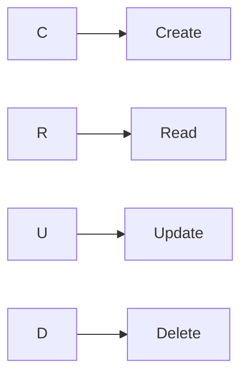

# Semana 07/06/22

#### Tema da aula: LOG

> Log = registro de eventos do sistema.

Lembrar sempre do CRUD

--------------------------------------------
# Log
#### Caminho absoluto para ver os logs

*Dir:* `/var/log/`
*Arquivos importantes* `syslog` e `auth.log`

*Por linha de comando*: `journalctl -f | ccze`

> who 
> loginctl

#### Legislação
> Marco civil da internet
> LGPD

#### Criamos um forms para usuários

> Nome Completo
> Conta (nome do usúario)
> Senha inicial

# Usuários em lote

    